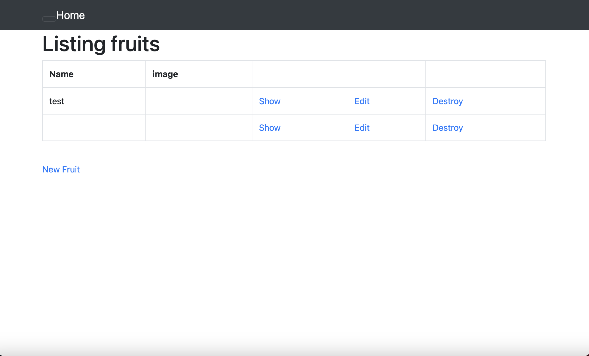
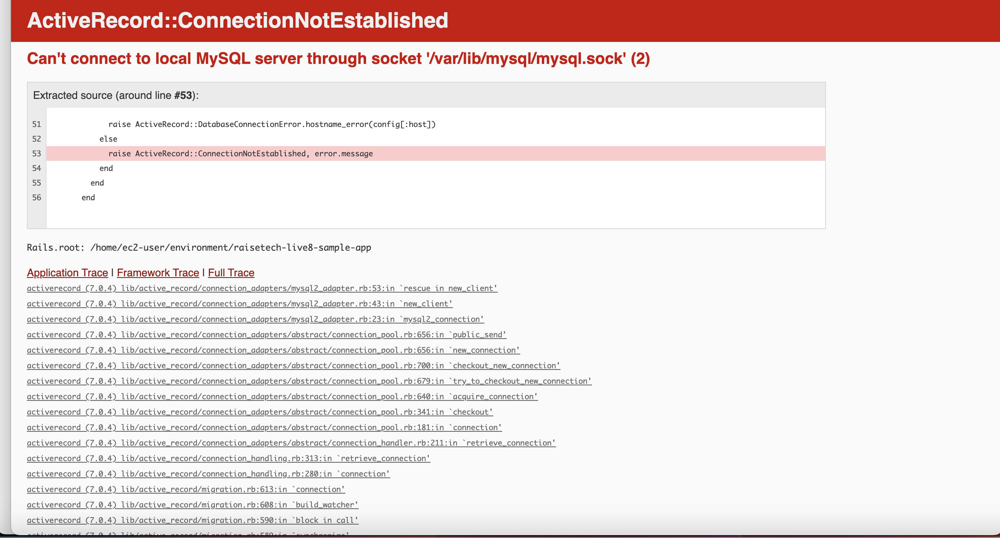

# **第3回課題　修正版2**

## 課題報告

### サンプルアプリケーション

### APサーバーの名前とバージョン
- :puma バージョン：5.65 

### APサーバーを終了させた場合引き続きアクセスできるか？
- アクセス不可 

### DBサーバー
- MYSQL　バージョン：8.0.34 

### DBサーバーを終了させた場合引き続きアクセスできるのか？
- アクセス不可 

### Railsの構成管理ツールの名前は？
- Bundler 

### 今回の課題で学んだこと
- 動画を見ながらやったことで上手くいかない原因の理解に時間がかかってしまった。その分、原因解決までの間に動画を理解する良い時間になった。
