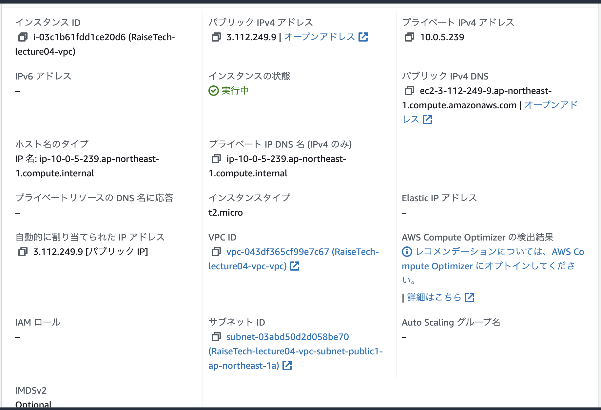
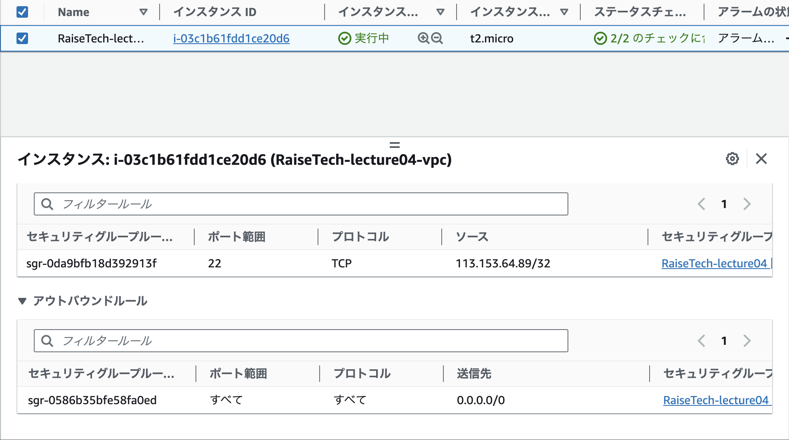
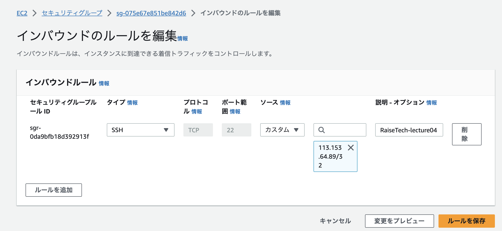
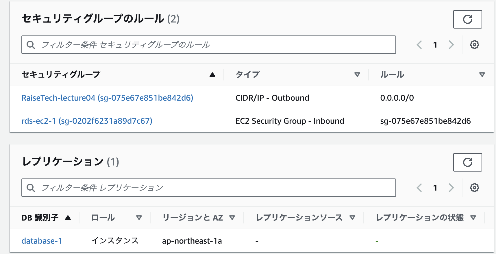
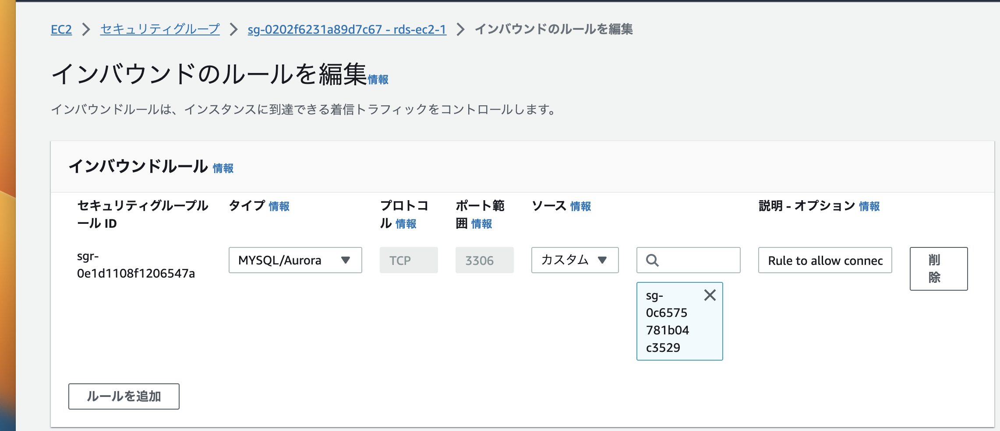
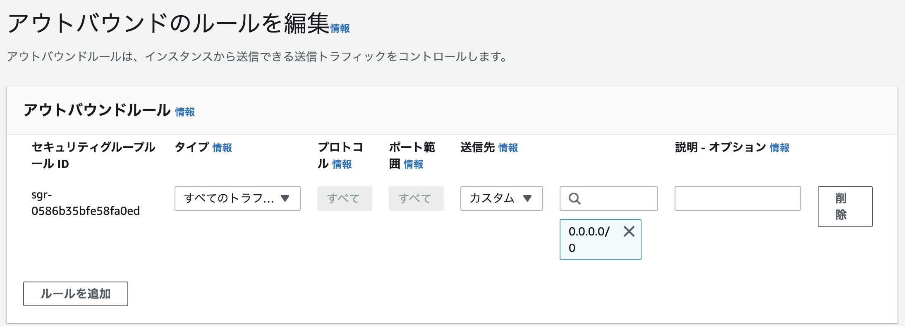
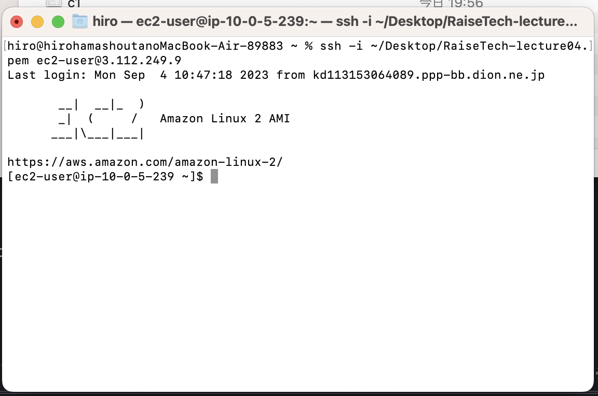
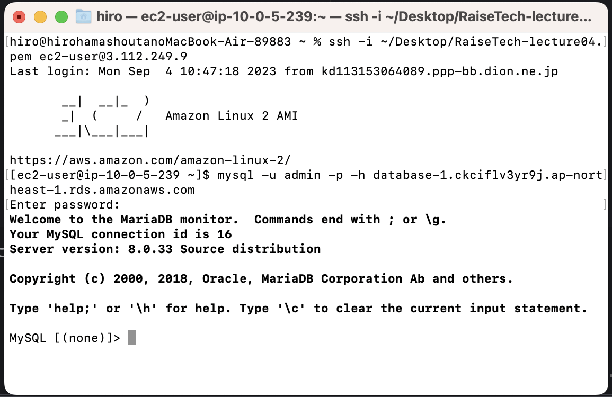

# **第4回課題　修正**

## 課題報告

### AWS上にVPC作成

### EC2構築

- パプリックIPアドレス設定

- セキュリティグループ設定
- インバウンドルールにマイIPを設定し自身のPCからのみアクセスできるように設定

### RDS構築

- セキュリティグループのルール
- インバウンドルールにEC2のセキュリティグループID指定し他にEC2からアクセスできないようにソースを指定

### EC2へ接続

### EC2からRDSへ接続を行い正常であることを確認

- EC2からMYSQLに接続できている

### 今回の課題で学んだこと
- AWSを用いて本格的に課題に取り組む上で無料枠で使える枠と課金が発生してしまう条件など把握して今後取り組んでいきます。セキュリティグループは今のうちに理解をもう少し不kめていきたいと思います。