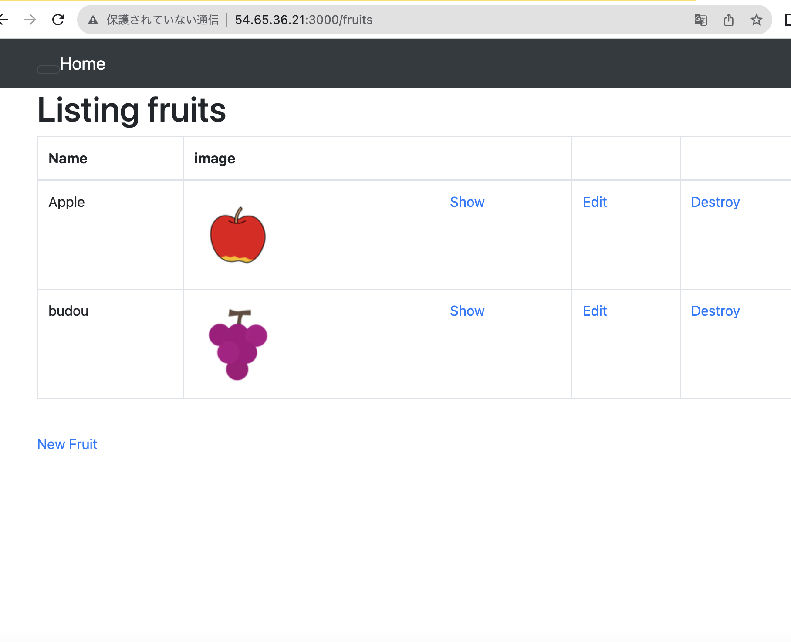
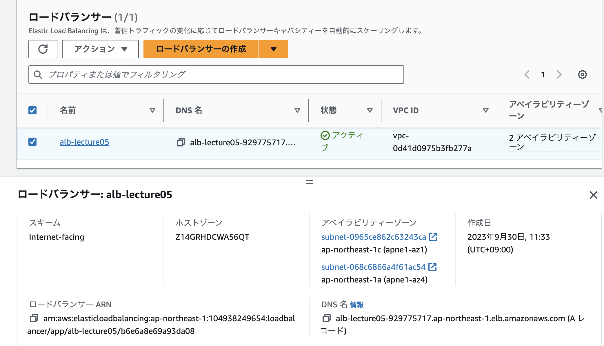
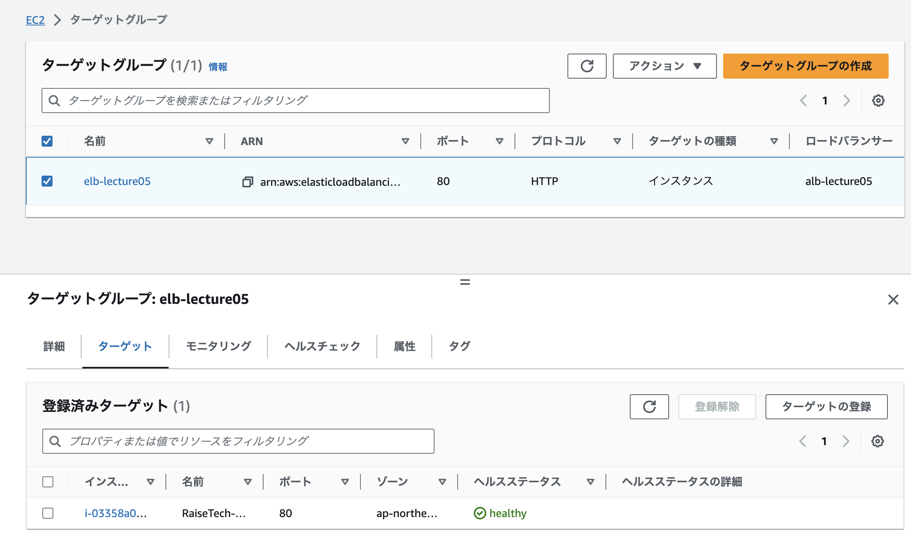
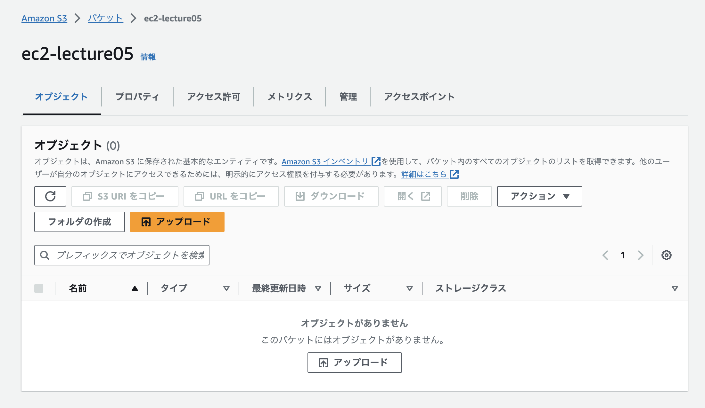
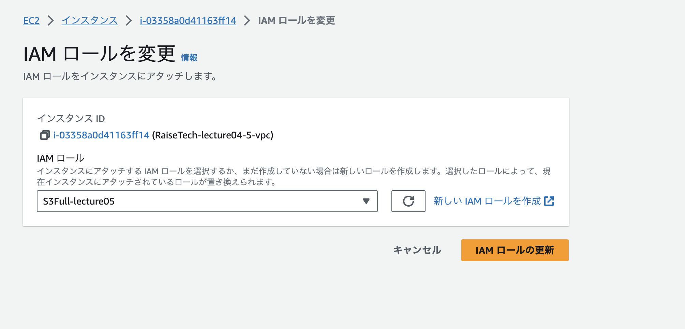
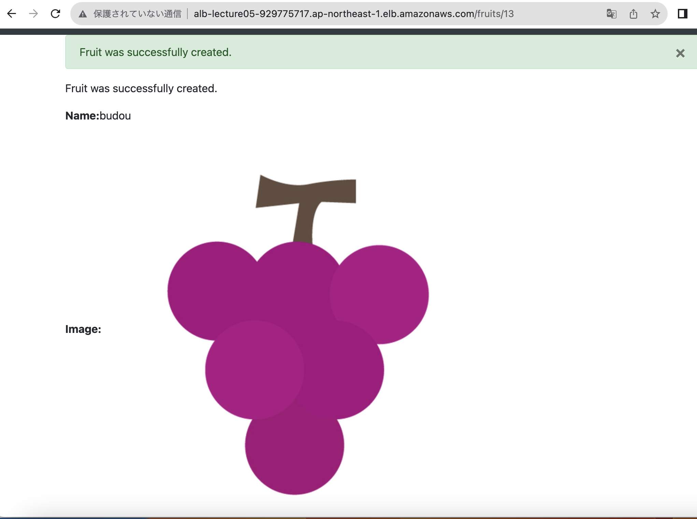
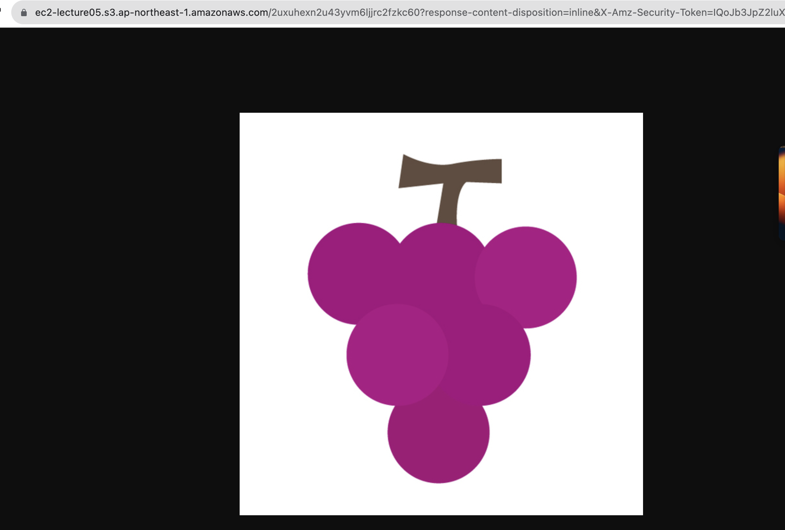
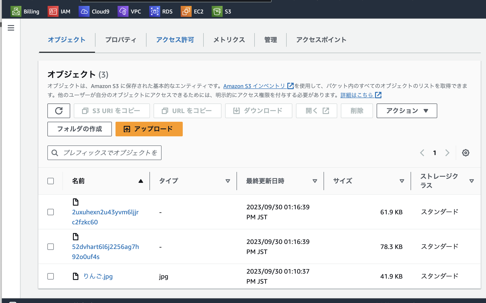
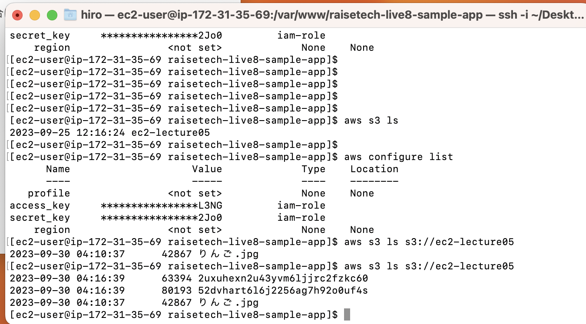
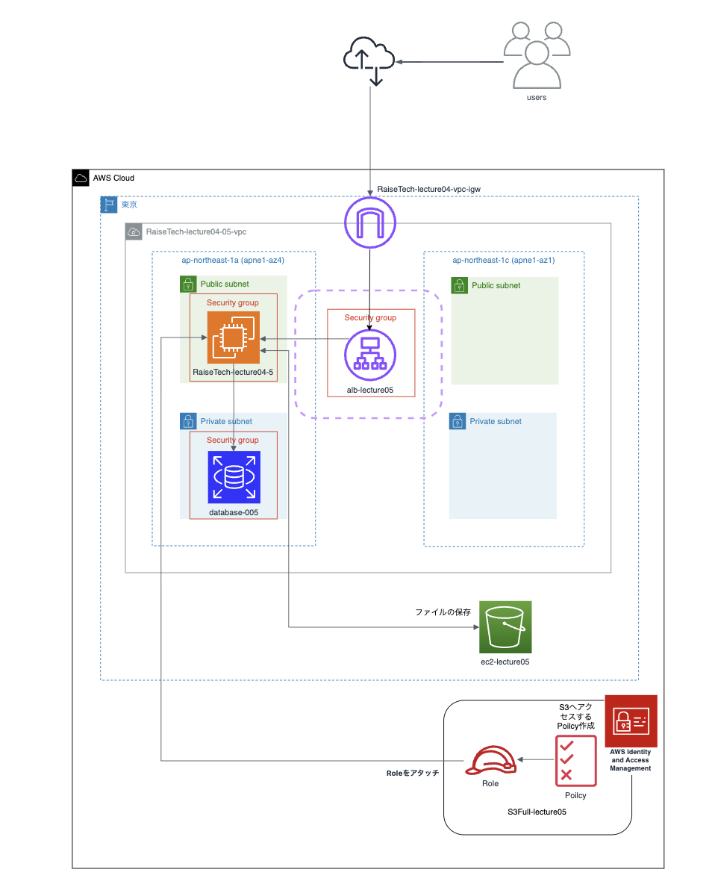

# **第5回課題**

## 課題報告

### EC2上にサンプルアプリケーションをデプロイ

### サーバーアプリケーション（nginx + unicon)だけで動作確認

だけで動作確認.png)

### ELB追加・動作確認

- ロードバランサー作成

- ターゲットグループ作成

- 動作確認

### S3作成

### EC2からS3にファイルを保存する

- EC2にS3にアクセスできるようにIAMロールを設定

- アプリケーションから画像の取り込み

- S3上で取り込めているかの確認

- EC2上でも取り込めているかの確認

### 構成図

### 今回の課題で学んだこと
- 課題5はこなすのに物凄く時間がかかりアプリケーションのデプロイするためのEC2の構築・動作確認など
- ハンズオンしなければ理解はできないことばかりだったと感じております。
- ELBの配置やS3を使ったデータの保存など奥深い課題で一つ一つ理解を得るためにも
- もっと自身で触っていくこと、細かくメモをとってある内容の深掘りなどよりしていけたらと思っております