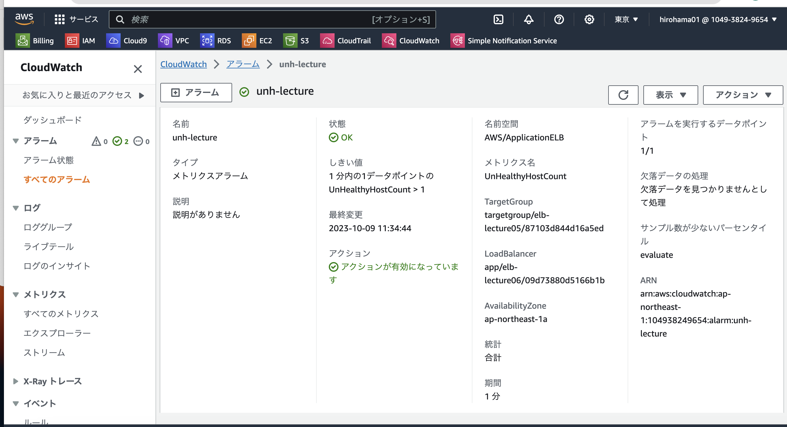
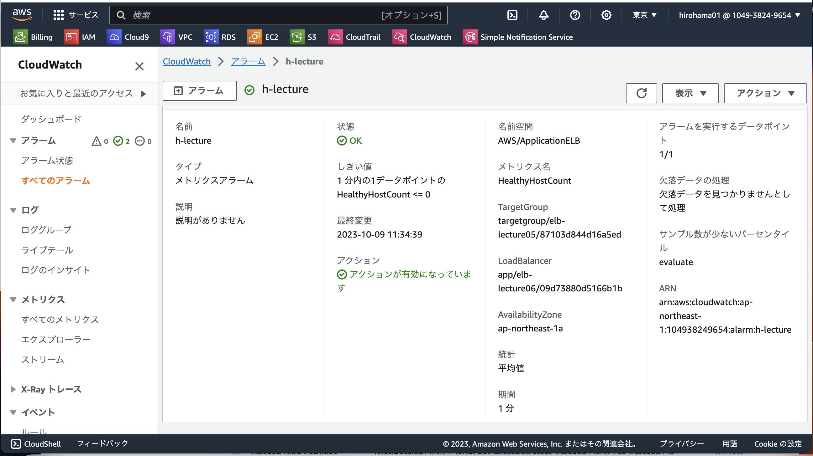
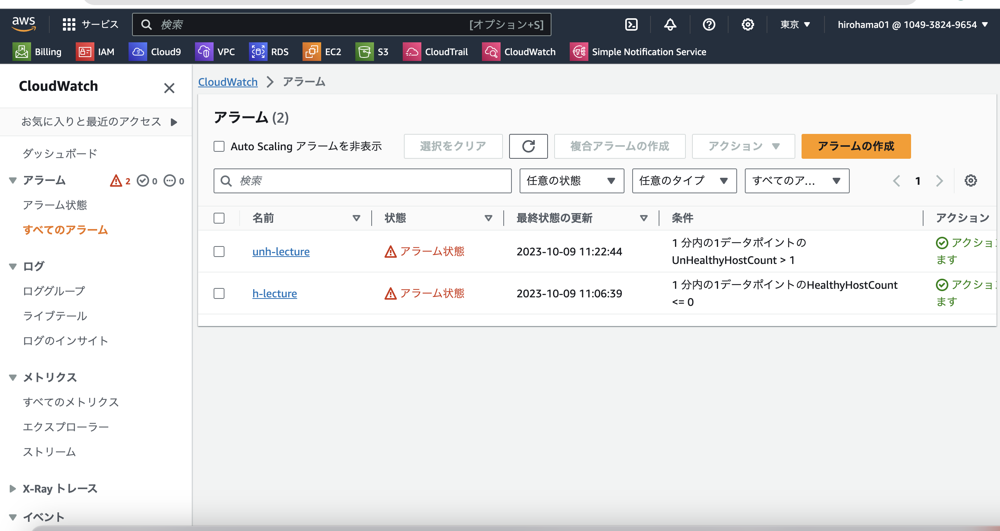
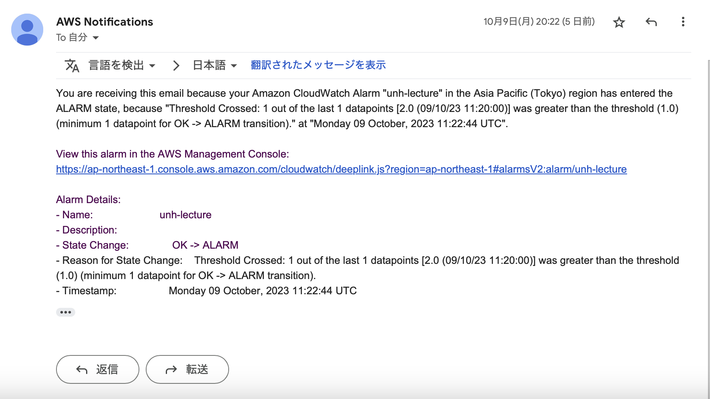
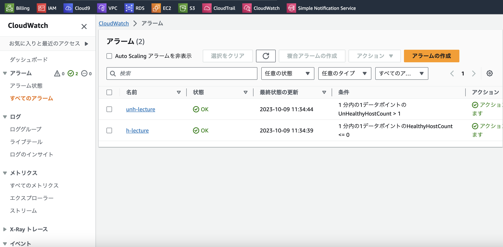
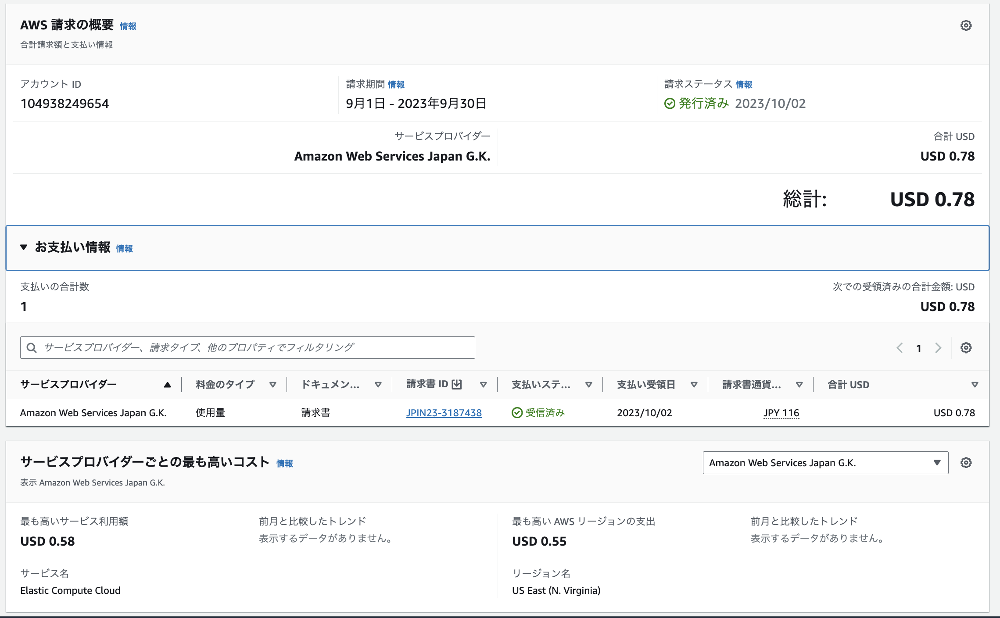
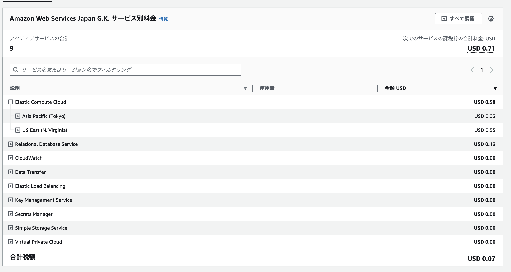
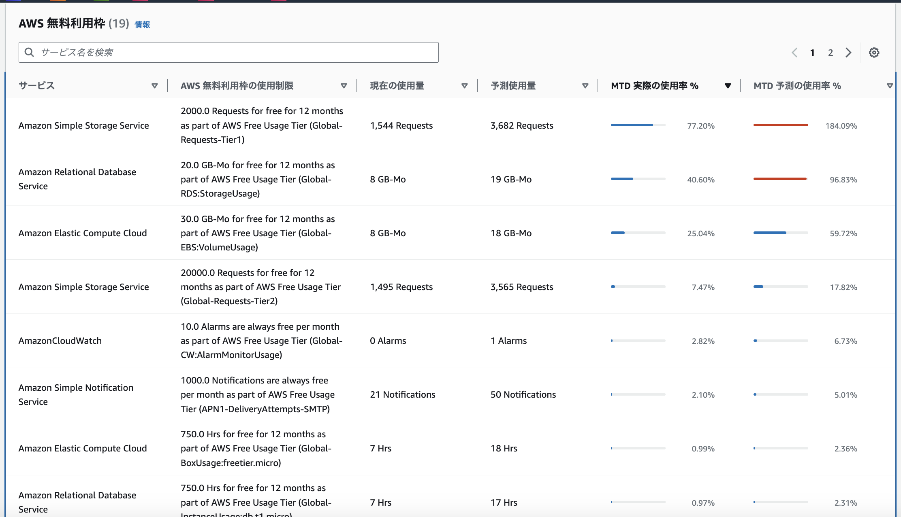

# **第6回課題**

## 課題報告

### あなたが最後にAWSを利用した日の記録を、どれでもよいのでCloudTrailのイベントから探し出してください。
 - "eventTime": "2023-10-02T13:47:13Z",
 - "eventSource": "ec2.amazonaws.com",
 - "sourceIPAddress": "113.153.64.89",

### cloudwatchアラームを使って、ALBのアラームを設定、AWS SNSを使って通知
 - UnHealthyHostCount

 - HealthyHostCount

 - アプリケーションが使えない、ヘルスチェックNGの場合、SNSが届いていること確認

- アプリケーションが使える、ヘルスチェックOKの場合

### AWS利用料の見積を作成

- 今日までに作成したリソースの内容を見積もり（lecture05構成）
- https://calculator.aws/#/estimate?id=ea4b5d2366140fb6d7cca6935afb771293be3327

### マネジメントコンソールから、現在の利用料を確認

- 先月の請求情報から、EC2の料金確認、USD 0.58

### 無料利用枠で収まっているのか

- S3(Amazon Simple Storage Service)がこのままだと無料利用枠に収まらない状態、課題５の時の操作で2,000 PUT/COPY/POST/LISTリクエストを超えそうな現状。課題をこなしていたCloudTrail のログによる S3による影響だと思い、S3は削除してあるが最低限コンソール画面からS3へのアクセスはするので最悪超えることにはなりそうと認識しております 

### 今回の課題で学んだこと
- AWSサービスを様々使うフェーズの中、改めて知らないことばかりで見積もり一つ作成する場合でも各種設定や機能の理解がより必要と感じた