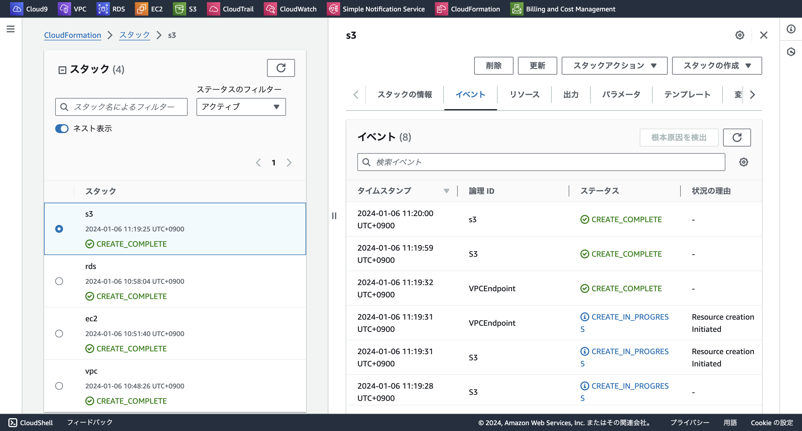
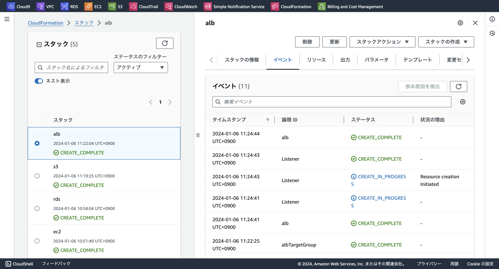

## 課題報告

### CloudFormation を利用して、現在までに作った環境をコード化しましょう。
 - 課題５で作成した構成図を元に環境を構築していく


### テンプレート・リソース VPC

```
AWSTemplateFormatVersion: "2010-09-09"
Description: lecture10 VPC
Mappings:
  RegionMap:
    ap-northeast-1a: 
      Name: "ap-northeast-1a"
    ap-northeast-1c: 
      Name: "ap-northeast-1c"  

# Parameters:
#  SystemName:
#    Type: String
#    Default: lecture10

#  EC2ImageId:
#    Type: AWS::SSM::Parameter::Value<AWS::EC2::Image::Id>
#    Default: /aws/service/ami-amazon-linux-latest/amzn2-ami-kernel-5.10-hvm-x86_64-gp2

Resources:

# VPC
#
#
  VPC:
    Type: AWS::EC2::VPC
    Properties:
      CidrBlock: 10.0.0.0/16
      EnableDnsSupport: true
      EnableDnsHostnames: true
      Tags:
        -
          Key: Name
          Value: VPC

  WebPublicSubnet1:
    Type: AWS::EC2::Subnet
    Properties:
      AvailabilityZone: ap-northeast-1a
      VpcId: !Ref VPC
      CidrBlock: 10.0.0.0/20
      MapPublicIpOnLaunch: true
      Tags:
        -
          Key: Name
          Value: PublicSubnet1
  
  WebPublicSubnet2:
    Type: AWS::EC2::Subnet
    Properties:
      AvailabilityZone: ap-northeast-1c
      VpcId: !Ref VPC
      CidrBlock: 10.0.16.0/20
      MapPublicIpOnLaunch: true
      Tags:
        -
          Key: Name
          Value: PublicSubnet2

  privatesubnet1:
    Type: AWS::EC2::Subnet
    Properties: 
      AvailabilityZone: ap-northeast-1a
      CidrBlock: 10.0.128.0/20
      MapPublicIpOnLaunch: true
      Tags:
        -  Key: Name
           Value: privatesubnet1
      VpcId: !Ref VPC

  privatesubnet2:
   Type: AWS::EC2::Subnet
   Properties: 
      AvailabilityZone: ap-northeast-1c
      CidrBlock: 10.0.144.0/20
      MapPublicIpOnLaunch: true
      Tags:
        - Key: Name
          Value: privatesubnet2
      VpcId: !Ref VPC
    
  rdssubnetgroup: 
   Type: AWS::RDS::DBSubnetGroup
   Properties: 
      DBSubnetGroupDescription: rdssubnetgroup
      SubnetIds:  
        - !Ref privatesubnet1
        - !Ref privatesubnet2
      DBSubnetGroupName: database-10
      Tags: 
      - Key: Name
        Value: rdssubnetgroup
  

# Internet Gateway
#
#
  InternetGateway:
    Type: AWS::EC2::InternetGateway

  InternetGatewayAttachment:
    Type: AWS::EC2::VPCGatewayAttachment
    Properties:
      InternetGatewayId: !Ref InternetGateway
      VpcId: !Ref VPC

# Routetable
#
#
  RouteTable:
    Type: AWS::EC2::RouteTable
    Properties:
      VpcId: !Ref VPC

  DefaultRoute:
    Type: AWS::EC2::Route
    Properties:
      RouteTableId:
        Ref: RouteTable
      DestinationCidrBlock: 0.0.0.0/0 
      GatewayId: 
        Ref: InternetGateway
    DependsOn: 
      - SubnetRouteTableAssociation

  SubnetRouteTableAssociation:
    Type: AWS::EC2::SubnetRouteTableAssociation
    Properties:
      RouteTableId: !Ref RouteTable
      SubnetId: !Ref WebPublicSubnet1
      
  privateroutetable:
   Type: AWS::EC2::RouteTable
   Properties:
    Tags:
      - Key: Name
        Value: privateroutetable
    VpcId: !Ref VPC

  routetableattach1:
   Type: AWS::EC2::SubnetRouteTableAssociation
   Properties: 
    RouteTableId: !Ref privateroutetable
    SubnetId: !Ref privatesubnet1

  routetableattach2:
   Type: AWS::EC2::SubnetRouteTableAssociation
   Properties: 
    RouteTableId: !Ref privateroutetable
    SubnetId: !Ref privatesubnet2


# エクスポートするためのセクション
Outputs:
  VPC:
    Value: !Ref VPC  # 作成されたVPCのIDを
    Export:
      Name: VPC  # この名前でエクスポートする
  
  WebPublicSubnet1:
    Value: !Ref WebPublicSubnet1  # 作成されたVPCのIDを
    Export:
      Name: WebPublicSubnet1  # この名前でエクスポートする

  WebPublicSubnet2:
    Value: !Ref WebPublicSubnet2  # 作成されたVPCのIDを
    Export:
      Name: WebPublicSubnet2  # この名前でエクスポートする

  rdssubnetgroup:
    Value: !Ref rdssubnetgroup  # 作成されたVPCのIDを
    Export:
      Name: rdssubnetgroup  # この名前でエクスポートする

  RouteTable:
    Value: !Ref RouteTable  # 作成されたVPCのIDを
    Export:
      Name: RouteTable  # この名前でエクスポートする

```


### テンプレート・リソース ec2

```
AWSTemplateFormatVersion: 2010-09-09

Description: lecture10 ec2

Resources:
# EC2
# 
#
  WebInstance:
    Type: AWS::EC2::Instance
    Properties: 
      ImageId: ami-0ff21806645c5e492
      InstanceType: t2.micro
      KeyName: RaiseTech-lecture04
      NetworkInterfaces:
        - AssociatePublicIpAddress: true
          DeleteOnTermination: true
          DeviceIndex: "0"
          GroupSet: 
              - !Ref PublicSecurityGroup
          SubnetId: {'Fn::ImportValue': 'WebPublicSubnet1'}
      Tags:
        -
          Key: Name
          Value: lecture10

 
# security group 
#
#
  PublicSecurityGroup: 
   Type: AWS::EC2::SecurityGroup
   Properties: 
    GroupDescription: PublicSecurityGroup
    SecurityGroupEgress: 
      - IpProtocol: -1
        FromPort: -1
        ToPort: -1
        CidrIp: 0.0.0.0/0
    SecurityGroupIngress:
      - IpProtocol: tcp
        FromPort: 80
        ToPort: 80
        CidrIp: 0.0.0.0/0
        FromPort: 443
        ToPort: 443
        CidrIp: 0.0.0.0/0
      - IpProtocol: tcp
        FromPort: 22
        ToPort: 22
        CidrIp: 0.0.0.0/0
    VpcId: {'Fn::ImportValue': 'VPC'}

# エクスポートするためのセクション
Outputs:
  PublicSecurityGroup:
    Value: !Ref PublicSecurityGroup  # 作成されたVPCのIDを
    Export:
      Name: PublicSecurityGroup  # この名前でエクスポートする

  WebInstance:
    Value: !Ref WebInstance  # 作成されたVPCのIDを
    Export:
      Name: WebInstance  # この名前でエクスポートする
```
 

### テンプレート・リソース rds

```
AWSTemplateFormatVersion: 2010-09-09

Description: lecture10 RDS

Resources:

  rdssecuritygroup:
   Type: AWS::EC2::SecurityGroup
   Properties: 
    GroupDescription: rds-securitygroup
    SecurityGroupEgress: 
      - IpProtocol: -1
        FromPort: -1
        ToPort: -1
        CidrIp: 0.0.0.0/0
    SecurityGroupIngress:
      - IpProtocol: tcp
        FromPort: 3306
        ToPort: 3306
        SourceSecurityGroupId: {'Fn::ImportValue': 'PublicSecurityGroup'}
    VpcId: {'Fn::ImportValue': 'VPC'}

  # RDS
  #
  #
  rdsinstance:  
    Type: AWS::RDS::DBInstance
    Properties: 
     AllocatedStorage: 20
     DBInstanceClass: db.t3.micro
     DBSubnetGroupName: 
        {'Fn::ImportValue': 'rdssubnetgroup'}
     Engine: mysql
     EngineVersion: 8.0.28
     MasterUsername: admin
     MasterUserPassword: adminadmin
     StorageType: gp2
     Tags:
      - Key: Name
        Value: rdsinstance
     VPCSecurityGroups:
      - !Ref rdssecuritygroup
```
 

### テンプレート・リソース s3

``` 
AWSTemplateFormatVersion: 2010-09-09
Description: lecture10 S3

Resources:

 S3:
   Type: AWS::S3::Bucket
   Properties:
     BucketName: lecture10
     AccessControl: Private
     PublicAccessBlockConfiguration:
       BlockPublicAcls: True
       BlockPublicPolicy: True
       IgnorePublicAcls: True
       RestrictPublicBuckets: True

 VPCEndpoint:
   Type: "AWS::EC2::VPCEndpoint"
   Properties:
     RouteTableIds: 
     - {'Fn::ImportValue': 'RouteTable'}
     ServiceName: com.amazonaws.ap-northeast-1.s3
     VpcEndpointType: Gateway
     VpcId: {'Fn::ImportValue': 'VPC'}

``` 


### テンプレート・リソース alb

``` 
AWSTemplateFormatVersion: 2010-09-09
Description: lecture10 alb

Resources:

 alb:
   Type: AWS::ElasticLoadBalancingV2::LoadBalancer
   Properties: 
     IpAddressType: ipv4
     Name: lecture10
     Scheme: internet-facing
     SecurityGroups: 
       - {'Fn::ImportValue': 'PublicSecurityGroup'}
     SubnetMappings: 
        - SubnetId: {'Fn::ImportValue': 'WebPublicSubnet1'}
        - SubnetId: {'Fn::ImportValue': 'WebPublicSubnet2'}
     Type: application
     Tags: 
       - Key: Name
         Value: lecutre10
 
 albTargetGroup:
   Type: AWS::ElasticLoadBalancingV2::TargetGroup
   Properties: 
     VpcId: {'Fn::ImportValue': 'VPC'}
     HealthCheckIntervalSeconds: 30
     HealthCheckEnabled: true
     HealthCheckPath: /
     HealthCheckPort: traffic-port
     HealthCheckProtocol: HTTP
     HealthCheckTimeoutSeconds: 5
     HealthyThresholdCount: 5
     IpAddressType: ipv4
     Port: 80
     Protocol: HTTP
     ProtocolVersion: HTTP1
     TargetType: instance
     Targets: 
         - Id: {'Fn::ImportValue': 'WebInstance'}
           Port: 80
     UnhealthyThresholdCount: 2
     Matcher: 
        HttpCode: 200
     Tags: 
       - Key: Name
         Value: lecture10 

 Listener:
  Type: AWS::ElasticLoadBalancingV2::Listener
  Properties:
     DefaultActions: 
       - Type: forward
         TargetGroupArn: !Ref albTargetGroup
     LoadBalancerArn: !Ref alb
     Port: 80
     Protocol: HTTP

``` 



### 今回の課題で学んだこと
- 今までの課題でAWSの機能を理解していないと難しい課題だと感じました。こなすまでに期間はかかりましたがハンズオンで触る重要性をより感じました。