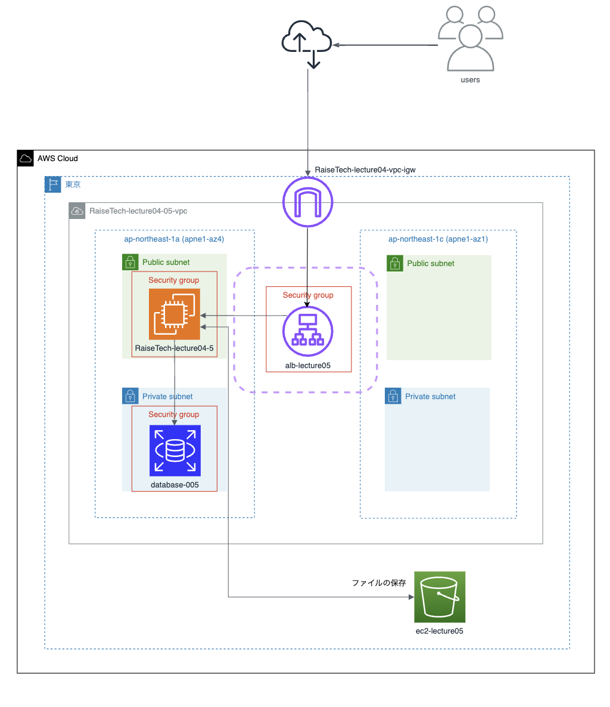
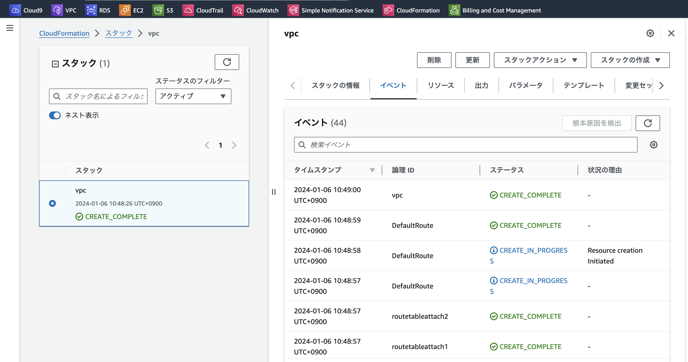
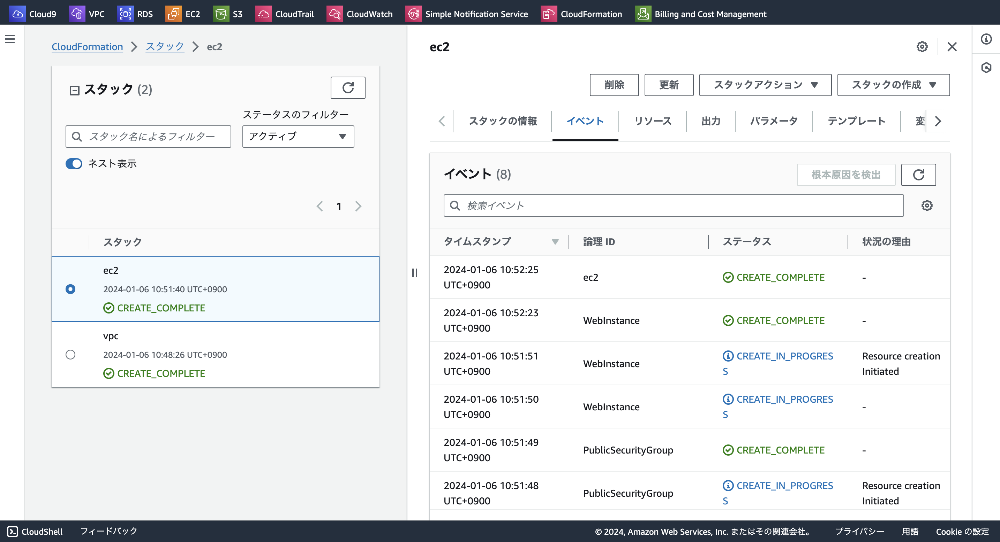
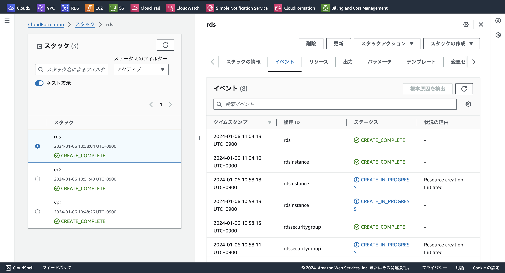
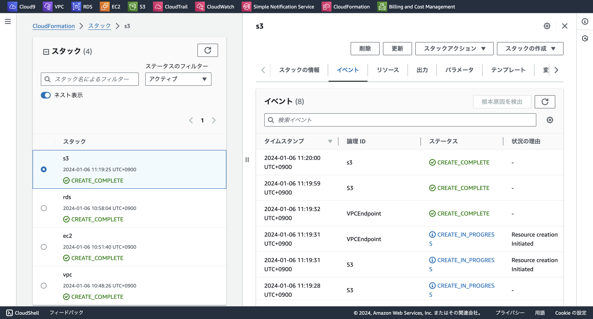

# **第10回課題**

## 課題報告

### CloudFormation を利用して、現在までに作った環境をコード化しましょう。
 - 課題５で作成した構成図を元に環境を構築していく

### テンプレート・リソース VPC

- cloudformationフォルダの[lecture10-vpc.outputs.yml](./cloudformation/lecture10-vpc.outputs.yml)参照

### テンプレート・リソース ec2

- cloudformationフォルダの[lecture10-ec2.inport.yml](./cloudformation/lecture10-ec2.inport.yml)参照

### テンプレート・リソース rds

- cloudformationフォルダの[lecture10-rds.inport.yml](./cloudformation/lecture10-rds.inport.yml)参照

### テンプレート・リソース s3

- cloudformationフォルダの[lecture10-s3.inport.yml](./cloudformation/lecture10-s3.inport.yml)参照

### テンプレート・リソース alb

- cloudformationフォルダの[lecture10-alb.inport.yml](./cloudformation/lecture10-alb.inport.yml)参照

### 今回の課題で学んだこと
- 今までの課題でAWSの機能を理解していないと難しい課題だと感じました。こなすまでに期間はかかりましたがハンズオンで触る重要性をより感じました。