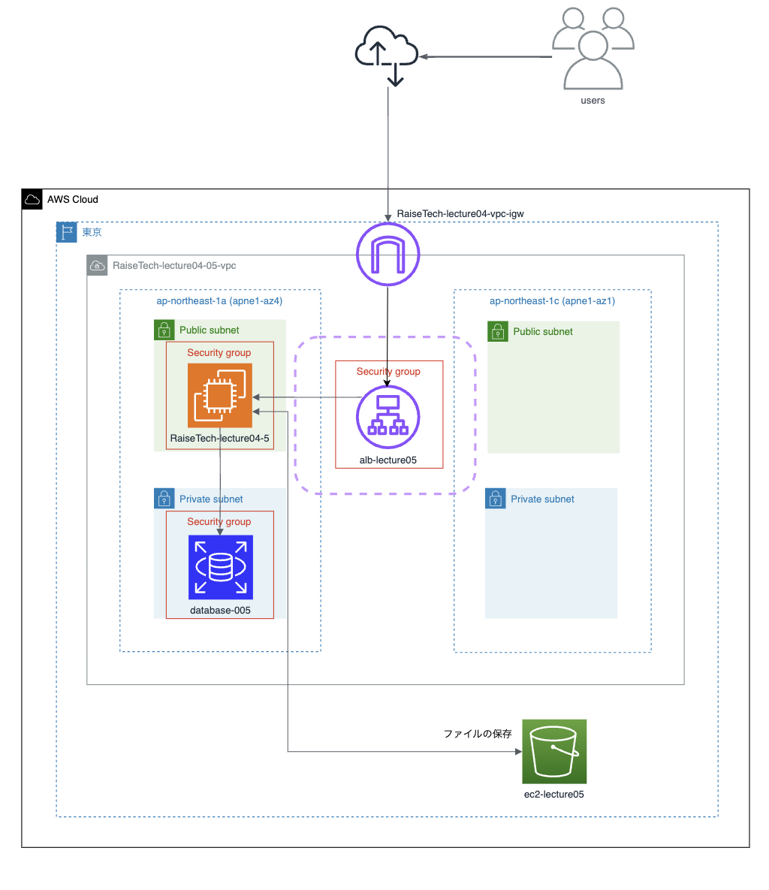
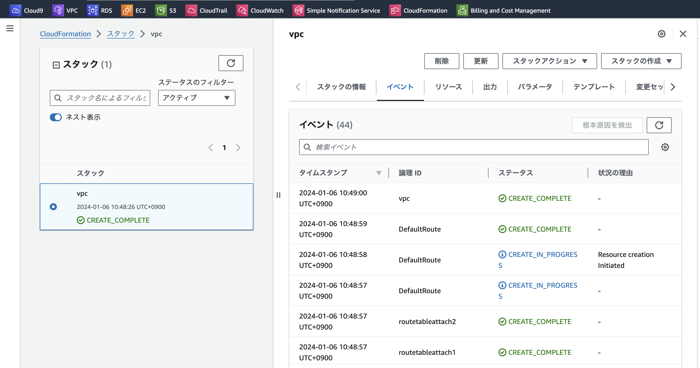

## 課題報告

### CloudFormation を利用して、現在までに作った環境をコード化しましょう。
 - 課題５で作成した構成図を元に環境を構築していく


### テンプレート・リソース
 
```
AWSTemplateFormatVersion: "2010-09-09"
Description: lecture10 VPC
Mappings:
  RegionMap:
    ap-northeast-1a: 
      Name: "ap-northeast-1a"
    ap-northeast-1c: 
      Name: "ap-northeast-1c"  

# Parameters:
#  SystemName:
#    Type: String
#    Default: lecture10

#  EC2ImageId:
#    Type: AWS::SSM::Parameter::Value<AWS::EC2::Image::Id>
#    Default: /aws/service/ami-amazon-linux-latest/amzn2-ami-kernel-5.10-hvm-x86_64-gp2

Resources:

# VPC
#
#
  VPC:
    Type: AWS::EC2::VPC
    Properties:
      CidrBlock: 10.0.0.0/16
      EnableDnsSupport: true
      EnableDnsHostnames: true
      Tags:
        -
          Key: Name
          Value: VPC

  WebPublicSubnet1:
    Type: AWS::EC2::Subnet
    Properties:
      AvailabilityZone: ap-northeast-1a
      VpcId: !Ref VPC
      CidrBlock: 10.0.0.0/20
      MapPublicIpOnLaunch: true
      Tags:
        -
          Key: Name
          Value: PublicSubnet1
  
  WebPublicSubnet2:
    Type: AWS::EC2::Subnet
    Properties:
      AvailabilityZone: ap-northeast-1c
      VpcId: !Ref VPC
      CidrBlock: 10.0.16.0/20
      MapPublicIpOnLaunch: true
      Tags:
        -
          Key: Name
          Value: PublicSubnet2

  privatesubnet1:
    Type: AWS::EC2::Subnet
    Properties: 
      AvailabilityZone: ap-northeast-1a
      CidrBlock: 10.0.128.0/20
      MapPublicIpOnLaunch: true
      Tags:
        -  Key: Name
           Value: privatesubnet1
      VpcId: !Ref VPC

  privatesubnet2:
   Type: AWS::EC2::Subnet
   Properties: 
      AvailabilityZone: ap-northeast-1c
      CidrBlock: 10.0.144.0/20
      MapPublicIpOnLaunch: true
      Tags:
        - Key: Name
          Value: privatesubnet2
      VpcId: !Ref VPC
    
  rdssubnetgroup: 
   Type: AWS::RDS::DBSubnetGroup
   Properties: 
      DBSubnetGroupDescription: rdssubnetgroup
      SubnetIds:  
        - !Ref privatesubnet1
        - !Ref privatesubnet2
      DBSubnetGroupName: database-10
      Tags: 
      - Key: Name
        Value: rdssubnetgroup
  

# Internet Gateway
#
#
  InternetGateway:
    Type: AWS::EC2::InternetGateway

  InternetGatewayAttachment:
    Type: AWS::EC2::VPCGatewayAttachment
    Properties:
      InternetGatewayId: !Ref InternetGateway
      VpcId: !Ref VPC

# Routetable
#
#
  RouteTable:
    Type: AWS::EC2::RouteTable
    Properties:
      VpcId: !Ref VPC

  DefaultRoute:
    Type: AWS::EC2::Route
    Properties:
      RouteTableId:
        Ref: RouteTable
      DestinationCidrBlock: 0.0.0.0/0 
      GatewayId: 
        Ref: InternetGateway
    DependsOn: 
      - SubnetRouteTableAssociation

  SubnetRouteTableAssociation:
    Type: AWS::EC2::SubnetRouteTableAssociation
    Properties:
      RouteTableId: !Ref RouteTable
      SubnetId: !Ref WebPublicSubnet1
      
  privateroutetable:
   Type: AWS::EC2::RouteTable
   Properties:
    Tags:
      - Key: Name
        Value: privateroutetable
    VpcId: !Ref VPC

  routetableattach1:
   Type: AWS::EC2::SubnetRouteTableAssociation
   Properties: 
    RouteTableId: !Ref privateroutetable
    SubnetId: !Ref privatesubnet1

  routetableattach2:
   Type: AWS::EC2::SubnetRouteTableAssociation
   Properties: 
    RouteTableId: !Ref privateroutetable
    SubnetId: !Ref privatesubnet2


# エクスポートするためのセクション
Outputs:
  VPC:
    Value: !Ref VPC  # 作成されたVPCのIDを
    Export:
      Name: VPC  # この名前でエクスポートする
  
  WebPublicSubnet1:
    Value: !Ref WebPublicSubnet1  # 作成されたVPCのIDを
    Export:
      Name: WebPublicSubnet1  # この名前でエクスポートする

  WebPublicSubnet2:
    Value: !Ref WebPublicSubnet2  # 作成されたVPCのIDを
    Export:
      Name: WebPublicSubnet2  # この名前でエクスポートする

  rdssubnetgroup:
    Value: !Ref rdssubnetgroup  # 作成されたVPCのIDを
    Export:
      Name: rdssubnetgroup  # この名前でエクスポートする

  RouteTable:
    Value: !Ref RouteTable  # 作成されたVPCのIDを
    Export:
      Name: RouteTable  # この名前でエクスポートする


```



 

### 今回の課題で学んだこと
- AWSサービスを様々使うフェーズの中、改めて知らないことばかりで見積もり一つ作成する場合でも各種設定や機能の理解がより必要と感じた