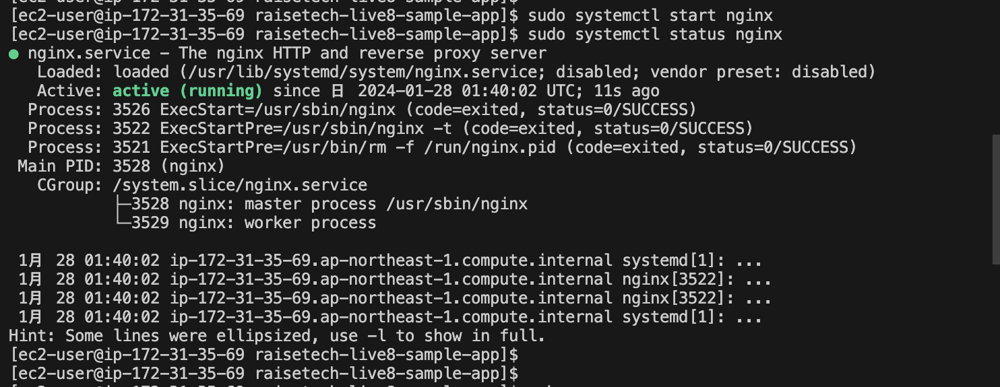
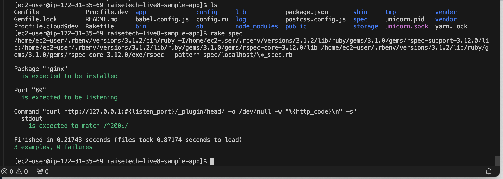

## 課題報告

### ServerSpec のテストが成功する環境の構築
  ## テスト内容
  - Nginxがインストール済であること
  - 指定のポートがリッスン（通信待ち受け状態）であること
  - テスト接続して動作すること

### 準備

- lecture5のEC2環境(Ruby・Nginxインストール済)を用いてテストを実施

### Serverspec設定

- gem install serverspec
- serverspec-init
```
Select OS type:

  1) UN*X

Select number: 1

Select a backend type:

  2) Exec (local)

Select number: 2

 + spec/
 + spec/localhost/
 + spec/localhost/httpd_spec.rb
 + spec/spec_helper.rb
 + Rakefile
```

### Nginxの起動

- sudo systemctl start nginx
- sudo systemctl status nginx




### Serverspec のサンプルテストコードを使用
- Nginxを80番ポートでリッスンさせるため、ポート番号を80に変更
```
require 'spec_helper'

listen_port = 80

describe package('nginx') do
  it { should be_installed }
end

describe port(listen_port) do
  it { should be_listening }
end

describe command('curl http://127.0.0.1:#{listen_port}/_plugin/head/ -o /dev/null -w "%{http_code}\n" -s') do
  its(:stdout) { should match /^200$/ }
end
```

### テスト実施

- rake spec
- curlの結果200でOKが返ってきている事、0 failuresになっている事を確認。



### 今回の課題で学んだこと
- インフラ環境を自動でテストする環境を構築したがテストに失敗した時にどこが原因なのかテストすることによって気づけることもありSeverSpecのようなツールを使うことでよりインフラ環境の構築に役立つと感じた。