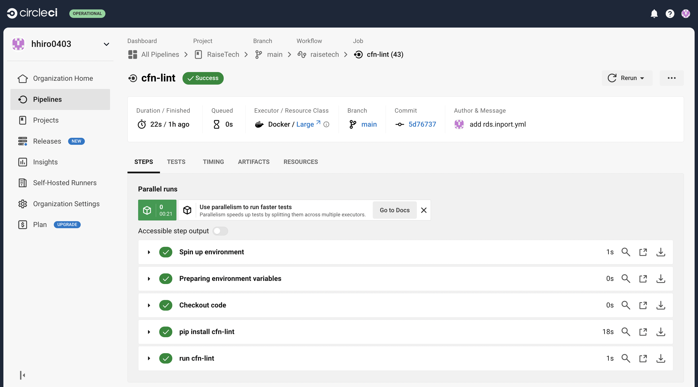

# **第12回課題**

## 課題報告

### CircleCIのサンプルコンフィグが正しく動作するようにリポジトリに組み込む
 - cfn-lintがcloudformationディレクトリ内のconfig.ymlファイルのチェックを行い問題なく成功することを確認する
 - config.ymlの詳細は下記参照
```
version: 2.1
orbs:
  python: circleci/python@2.0.3
jobs:
  cfn-lint:
    executor: python/default
    steps:
      - checkout
      - run: pip install cfn-lint
      - run:
          name: run cfn-lint
          command: |
            cfn-lint -i W3002 -t cloudformation/*.yml

workflows:
  raisetech:
    jobs:
      - cfn-lint
```
  

### 今回の課題で学んだこと
- CircleCIを課題の動画や資料で最初に知ったときは全然理解できなかったがで構文エラーなど多発して修正していくうちに理解をかなり深められた