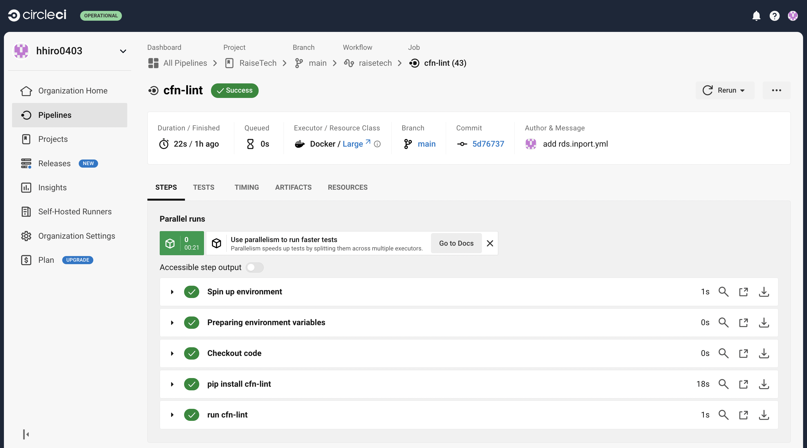

# **第12回課題**

## 課題報告

### CircleCIのサンプルコンフィグが正しく動作するようにリポジトリに組み込む
 - cfn-lintがcloudformationディレクトリ内のymlファイルをチェックを行い成功することを確認
 - 

### 今回の課題で学んだこと
- CircleCIを課題の動画や資料で最初に知ったときは全然理解できなかったがymlファイルのチェックで構文エラーなど多発して修正していくうちに理解をかなり深められた